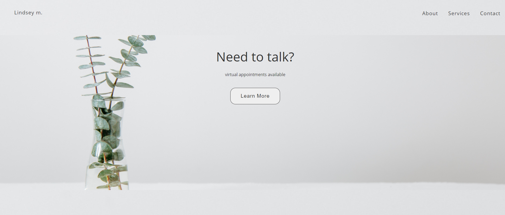
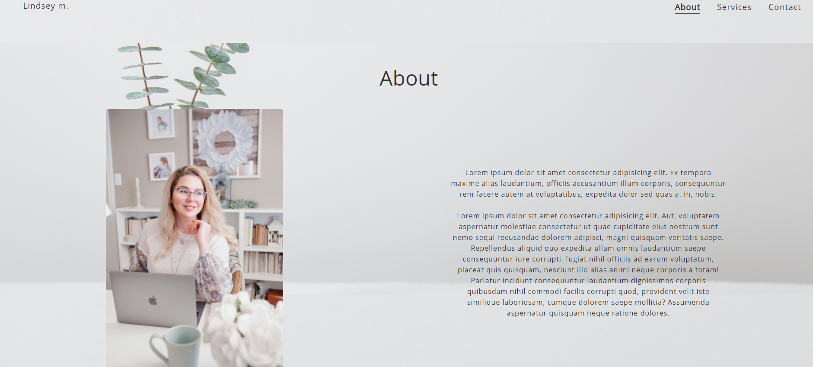
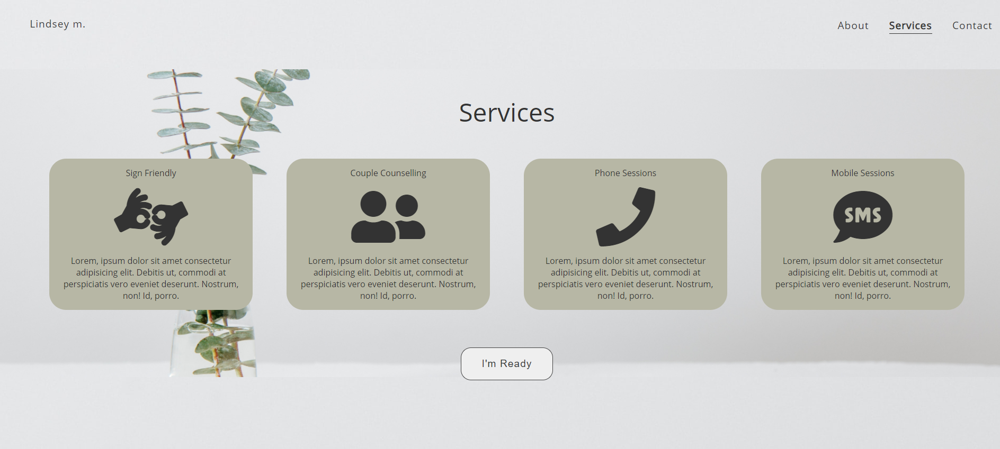
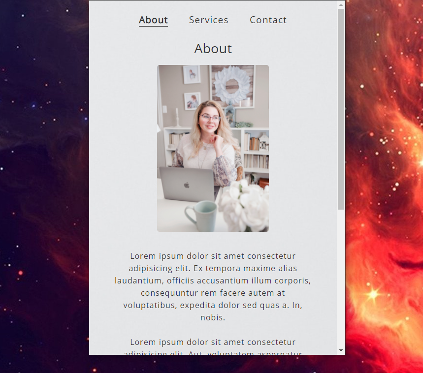
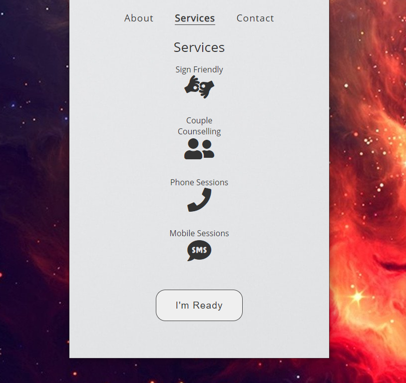

## Counselling Site 

## Summary

A clean and simple website I designed and created for a counselling client. The aesthetic is intented to be calming and clear. 

 

 

 

 

 

 

 

 

 

 

 

 

 

 

The page was built mobile first, with a breakpoint for tablets and small laptops, as well as larger screens.

 

 
 

 

  

 

 

This is one of several website projects that I've been creating recently to get practice in between portfolio projects to keep sharp with the basics of
html/css and flexbox

**Author**
 
**Robin Fussell** _- Software Developer_ | [LinkedIn](https://www.linkedin.com/in/robin-fussell17/)
